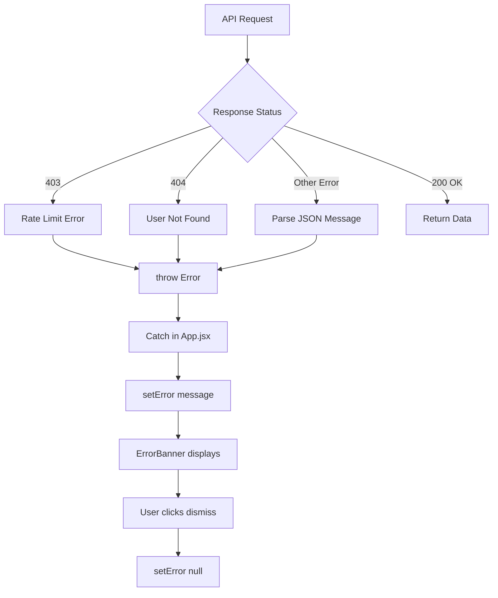

## Overview

GitScope is a React-based GitHub repository dashboard built with a component-driven architecture. The application follows a unidirectional data flow pattern, with state management handled entirely through React's built-in hooks (no external state libraries).

## Architecture Layers

<CardGroup cols={2}>
  <Card title="Data Layer" icon="database">
    Custom `useGitHub` hook encapsulates all GitHub API communication
  </Card>
  <Card title="Component Layer" icon="layer-group">
    Modular React components with CSS Modules for styling
  </Card>
  <Card title="State Layer" icon="sitemap">
    React hooks (`useState`, `useEffect`, `useCallback`) for state management
  </Card>
  <Card title="Presentation Layer" icon="palette">
    CSS Variables + CSS Modules for theming and scoped styles
  </Card>
</CardGroup>

---

## Data Layer: `useGitHub` Hook

The `useGitHub` hook (`src/hooks/useGitHub.js`) serves as the complete data access layer for the GitHub API.

### Key Responsibilities

<AccordionGroup>
  <Accordion title="Token Management">
    - Stores GitHub Personal Access Token in `localStorage`
    - Automatically includes token in request headers via `Authorization: Bearer {token}`
    - Provides `saveToken` function to persist or remove tokens
    - Token persists across sessions for authenticated rate limits (5,000 req/h vs 60 req/h)
  </Accordion>

  <Accordion title="Rate Limit Tracking">
    Extracts rate limit headers from every API response:
    ```javascript
    x-ratelimit-remaining  // Requests remaining
    x-ratelimit-limit      // Total request limit
    x-ratelimit-reset      // Unix timestamp when limit resets
    ```
    Exposes reactive `rateLimit` state that updates automatically on each request.
  </Accordion>

  <Accordion title="Error Handling">
    - **403**: Rate limit exceeded → throws descriptive error
    - **404**: User not found → throws "Usuario no encontrado"
    - **Other**: Parses JSON error message or falls back to HTTP status
  </Accordion>

  <Accordion title="API Methods">
    The hook exposes four core methods:
    - `getUser(username)` → `/users/:username`
    - `getRepos(username, page, per_page)` → `/users/:username/repos`
    - `getCommits(owner, repo, per_page)` → `/repos/:owner/:repo/commits`
    - `getLanguages(owner, repo)` → `/repos/:owner/:repo/languages`
  </Accordion>
</AccordionGroup>

### Implementation Details

**Location**: `src/hooks/useGitHub.js:1-63`

```javascript
const request = useCallback(async (path, params = {}) => {
  const url = new URL(`${BASE}${path}`)
  Object.entries(params).forEach(([k, v]) => url.searchParams.set(k, v))
  
  const res = await fetch(url.toString(), { headers: headers() })
  
  // Extract rate limit from response headers
  const remaining = res.headers.get('x-ratelimit-remaining')
  const limit = res.headers.get('x-ratelimit-limit')
  const reset = res.headers.get('x-ratelimit-reset')
  if (remaining !== null) {
    setRateLimit({ remaining: +remaining, limit: +limit, reset: +reset * 1000 })
  }

  // Handle errors
  if (res.status === 403) {
    const data = await res.json()
    throw new Error(data.message || 'Rate limit exceeded')
  }
  if (res.status === 404) throw new Error('Usuario no encontrado')
  if (!res.ok) {
    const data = await res.json()
    throw new Error(data.message || `HTTP ${res.status}`)
  }

  return res.json()
}, [headers])
```

<Note>
  All API methods use `useCallback` to prevent unnecessary re-renders and maintain stable function references across renders.
</Note>

---

## Component Architecture

GitScope follows a **container/presentational** component pattern with App.jsx as the root container.

### Component Hierarchy

```
App.jsx (root container)
├── Header.jsx
│   ├── Theme toggle
│   ├── Rate limit indicator
│   └── Token modal trigger
├── SearchBar.jsx
│   ├── Search input
│   └── Suggestion chips
├── UserCard.jsx
│   └── User profile & stats
├── LanguageChart.jsx
│   └── Recharts donut chart
├── RepoList.jsx
│   ├── Filter controls
│   ├── Sort dropdown
│   ├── Repository grid
│   └── Pagination controls
├── CommitPanel.jsx (conditional)
│   ├── Recent commits list
│   └── Repository metadata
├── TokenModal.jsx (conditional)
│   └── Token input form
└── ErrorBanner.jsx (conditional)
    └── Dismissible error message
```

### Component Communication

<Steps>
  <Step title="Parent → Child (Props)">
    App.jsx passes down data and callbacks as props
    ```jsx
    <RepoList
      repos={repos}
      onSelectRepo={setSelectedRepo}
      selectedRepo={selectedRepo}
    />
    ```
  </Step>

  <Step title="Child → Parent (Callbacks)">
    Children invoke callbacks passed as props
    ```jsx
    // In RepoList.jsx
    <button onClick={() => onSelectRepo(repo)}>
    ```
  </Step>

  <Step title="Sibling Communication">
    Siblings communicate via shared parent state
    - User selection in SearchBar → triggers data fetch in App → updates UserCard + RepoList
  </Step>
</Steps>

---

## State Management

All state lives in `App.jsx` and is managed through React's built-in hooks. No external state management libraries (Redux, Zustand, etc.) are used.

### Core State Variables

| State | Type | Purpose | Persistence |
|-------|------|---------|-------------|
| `theme` | string | `'light'` or `'dark'` | localStorage |
| `user` | object | GitHub user profile data | session |
| `repos` | array | Current page of repositories | session |
| `selectedRepo` | object | Currently selected repository for commit view | session |
| `loading` | boolean | Loading indicator state | session |
| `error` | string | Error message to display | session |
| `page` | number | Current pagination page (1-based) | session |
| `hasMore` | boolean | Whether more repos exist | session |
| `currentUsername` | string | Username being analyzed | session |
| `showToken` | boolean | Token modal visibility | session |

### State Management Patterns

#### 1. Derived State from Hook

```javascript
const { token, saveToken, rateLimit, getUser, getRepos, getCommits, getLanguages } = useGitHub()
```

The `useGitHub` hook manages token and rate limit state internally, exposing them as reactive values.

#### 2. Async State Updates

**Location**: `src/App.jsx:35-57`

```javascript
const search = useCallback(async (username) => {
  setLoading(true)
  setError(null)
  setUser(null)
  setRepos([])
  setSelectedRepo(null)
  setPage(1)
  setCurrentUsername(username)

  try {
    const [userData, reposData] = await Promise.all([
      getUser(username),
      getRepos(username, 1, PER_PAGE),
    ])
    setUser(userData)
    setRepos(reposData)
    setHasMore(reposData.length === PER_PAGE)
  } catch (e) {
    setError(e.message)
  } finally {
    setLoading(false)
  }
}, [getUser, getRepos])
```

<Tip>
  `Promise.all` parallelizes user and repository fetches for faster initial load.
</Tip>

#### 3. Effect-Based Pagination

**Location**: `src/App.jsx:59-71`

```javascript
useEffect(() => {
  if (!currentUsername || page === 1) return
  setLoading(true)
  getRepos(currentUsername, page, PER_PAGE)
    .then(data => {
      setRepos(data)
      setHasMore(data.length === PER_PAGE)
      setSelectedRepo(null)
      window.scrollTo({ top: 0, behavior: 'smooth' })
    })
    .catch(e => setError(e.message))
    .finally(() => setLoading(false))
}, [page])
```

<Warning>
  The pagination effect only runs when `page` changes and `page !== 1` (initial load is handled by `search` function).
</Warning>

---

## Caching Strategies

### Language Chart Cache

The `LanguageChart` component implements an **in-memory cache** using `useRef` to avoid redundant API calls.

**Location**: `src/components/LanguageChart.jsx:27-42`

```javascript
const cache = useRef({})

useEffect(() => {
  if (!repos.length) return
  let cancelled = false
  setLoading(true)

  const top = repos.slice(0, 12)
  const fetches = top.map(r => {
    const key = `${username}/${r.name}`
    if (cache.current[key]) return Promise.resolve(cache.current[key])
    return getLanguages(username, r.name).then(d => {
      cache.current[key] = d
      return d
    }).catch(() => ({}))
  })

  Promise.all(fetches).then(results => {
    // Process and aggregate language data...
  })
}, [repos, username])
```

### Cache Characteristics

<CardGroup cols={2}>
  <Card title="Scope" icon="memory">
    Component-level (not app-wide)
  </Card>
  <Card title="Lifetime" icon="clock">
    Persists while component is mounted
  </Card>
  <Card title="Key Format" icon="key">
    `username/repo-name`
  </Card>
  <Card title="Eviction" icon="trash">
    Cleared on component unmount
  </Card>
</CardGroup>

### Benefits

- **Reduces API calls**: If user navigates away and back, languages aren't re-fetched
- **Improves rate limit usage**: Only fetches each repo's languages once per session
- **Faster re-renders**: Cached data resolves immediately with `Promise.resolve`

<Info>
  The cache only stores the top 12 repositories' language data to limit API consumption.
</Info>

---

## Pagination Implementation

GitScope uses **client-side pagination** with server-side data fetching.

### Strategy

1. Fetch 30 repos per page from GitHub API
2. Detect if more pages exist: `hasMore = data.length === PER_PAGE`
3. Update `page` state to trigger new fetch
4. Replace current `repos` array with new page data

**Location**: `src/components/RepoList.jsx:115-131`

```jsx
<div className={styles.pagination}>
  <button
    className={styles.pageBtn}
    onClick={() => setPage(p => Math.max(1, p - 1))}
    disabled={page === 1}
  >
    <ChevronLeft size={16} /> Anterior
  </button>
  <span className={styles.pageInfo}>Página {page}</span>
  <button
    className={styles.pageBtn}
    onClick={() => setPage(p => p + 1)}
    disabled={!hasMore}
  >
    Siguiente <ChevronRight size={16} />
  </button>
</div>
```

### GitHub API Parameters

```javascript
getRepos(username, page, per_page)
// Translates to: GET /users/:username/repos?page=2&per_page=30&sort=updated&direction=desc
```

<Note>
  GitHub's API automatically sorts by `updated` in descending order, so the most recently updated repos appear first.
</Note>

---

## Design Patterns

### 1. Custom Hook Pattern

**Purpose**: Encapsulate and reuse stateful logic

**Example**: `useGitHub` hook abstracts all GitHub API logic into a reusable, testable unit.

```javascript
function useGitHub() {
  const [token, setToken] = useState(...)
  const [rateLimit, setRateLimit] = useState(...)
  // ... internal logic ...
  return { token, saveToken, rateLimit, getUser, getRepos, ... }
}
```

### 2. Compound Component Pattern

**Purpose**: Related components that work together

**Example**: `RepoList` contains filter controls, grid, and pagination as a cohesive unit.

### 3. Controlled Component Pattern

**Purpose**: Parent component controls child state

**Example**: App.jsx controls `selectedRepo` state and passes it to both `RepoList` and `CommitPanel`.

```jsx
<RepoList selectedRepo={selectedRepo} onSelectRepo={setSelectedRepo} />
<CommitPanel repo={selectedRepo} onClose={() => setSelectedRepo(null)} />
```

### 4. Optimistic UI Updates

**Purpose**: Improve perceived performance

**Example**: Theme toggle updates immediately without waiting for localStorage write.

```javascript
const toggleTheme = () => {
  const newTheme = theme === 'dark' ? 'light' : 'dark'
  setTheme(newTheme)  // Immediate UI update
  document.documentElement.setAttribute('data-theme', newTheme)
  localStorage.setItem('theme', newTheme)  // Async persistence
}
```

### 5. Error Boundary Pattern (Manual)

**Purpose**: Graceful error handling

**Example**: App-level error state with dismissible banner.

```jsx
{error && (
  <ErrorBanner message={error} onDismiss={() => setError(null)} />
)}
```

---

## Performance Optimizations

<AccordionGroup>
  <Accordion title="useCallback for Stable Function References">
    Prevents child component re-renders when functions are passed as props.
    
    ```javascript
    const search = useCallback(async (username) => {
      // ... search logic ...
    }, [getUser, getRepos])
    ```
  </Accordion>

  <Accordion title="Lazy Component Mounting">
    Conditional rendering ensures expensive components only mount when needed:
    - `CommitPanel` only mounts when `selectedRepo` is set
    - `TokenModal` only mounts when `showToken` is true
  </Accordion>

  <Accordion title="Debounced Animations">
    Staggered fade-up animations use CSS delays to avoid layout thrashing:
    ```css
    .fade-up { animation: fadeUp .4s ease both; }
    .fade-up-delay-1 { animation-delay: .05s; }
    .fade-up-delay-2 { animation-delay: .1s; }
    ```
  </Accordion>

  <Accordion title="Promise.all for Parallel Fetches">
    User profile and repositories load simultaneously:
    ```javascript
    const [userData, reposData] = await Promise.all([
      getUser(username),
      getRepos(username, 1, PER_PAGE),
    ])
    ```
  </Accordion>

  <Accordion title="CSS Modules for Scoped Styles">
    Each component has isolated styles that don't pollute global namespace, reducing CSS parsing overhead.
  </Accordion>
</AccordionGroup>

---

## Event Flow Example

Let's trace what happens when a user searches for "torvalds":

<Steps>
  <Step title="User Input">
    User types "torvalds" in SearchBar and clicks "Analizar"
  </Step>

  <Step title="SearchBar → App">
    SearchBar calls `onSearch('torvalds')` prop (which is `App.search`)
  </Step>

  <Step title="App State Reset">
    App sets loading=true, clears user/repos/error, resets page=1
  </Step>

  <Step title="API Requests">
    Parallel fetch of `/users/torvalds` and `/users/torvalds/repos?page=1&per_page=30`
  </Step>

  <Step title="Rate Limit Update">
    `useGitHub` extracts rate limit from response headers → updates `rateLimit` state
  </Step>

  <Step title="App State Update">
    Sets `user`, `repos`, `hasMore`, `loading=false`
  </Step>

  <Step title="Component Re-render">
    UserCard, RepoList, and LanguageChart receive new props and render
  </Step>

  <Step title="Language Chart Fetch">
    LanguageChart fetches languages for top 12 repos in parallel
  </Step>

  <Step title="Cache Population">
    Language data stored in LanguageChart's useRef cache
  </Step>

  <Step title="Chart Render">
    Recharts donut chart renders with aggregated language data
  </Step>
</Steps>

---

## Error Handling Flow



<Warning>
  Always wrap API calls in try/catch blocks to ensure errors are captured and displayed to the user.
</Warning>

---

## Next Steps

<CardGroup cols={2}>
  <Card title="Project Structure" icon="folder-tree" href="/development/project-structure">
    Explore the file and folder organization
  </Card>
  <Card title="Tech Stack" icon="layer-group" href="/development/tech-stack">
    Learn about the technologies and dependencies
  </Card>
</CardGroup>